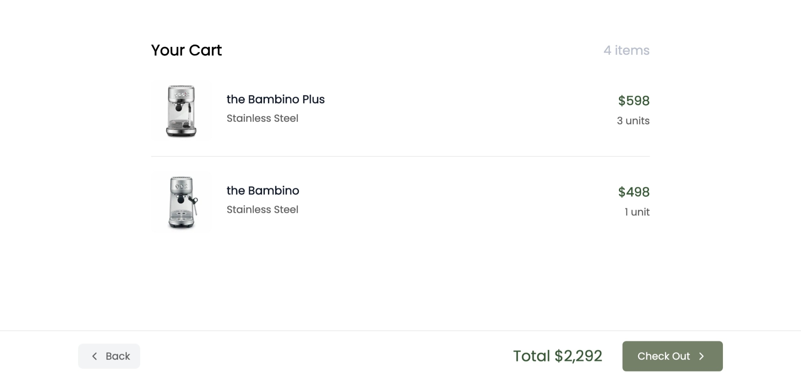
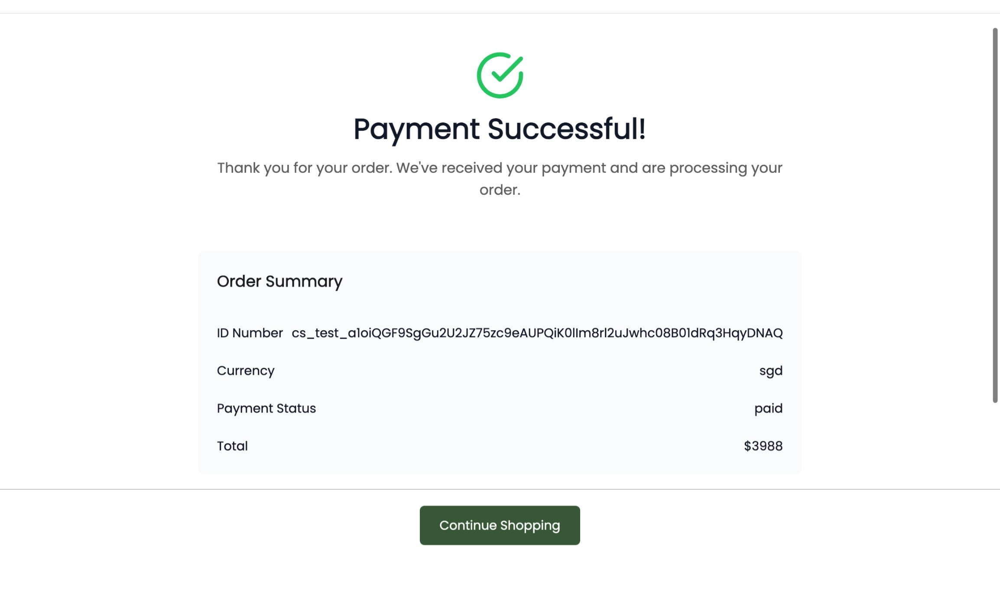

# ROLO Commerce - Next.js E-commerce Website

A modern, responsive e-commerce website built with Next.js 14, TypeScript, and Tailwind CSS. This project showcases a coffee machine store with a clean, minimalist design.

## Features

- 🚀 **Next.js 14** with App Router
- 💎 **TypeScript** for type safety
- 🎨 **Tailwind CSS** for modern styling
- 📱 **Responsive design** for all devices
- 🔍 **Search functionality** for products
- 🛒 **Shopping cart** system

## Screenshots

- Overall Catalog Screen:
  

- Search Results:
  

- Product Detail:
  

- Cart:
  

- Customer Details:
  

- Stripe Checkout:
  

- Success Checkout:
  

## Getting Started

### Prerequisites

- Node.js 18+
- npm or yarn

### Installation

1. Clone the repository:

```bash
git clone <repository-url>
cd rolo-commerce
```

2. Install dependencies:

```bash
npm install
# or
yarn install
```

3. Run the development server:

```bash
npm run dev
# or
yarn dev
```

4. Open [http://localhost:3000](http://localhost:3000) in your browser.

## Project Structure

```
rolo-commerce/
├── app/                    # Next.js App Router
│   ├── globals.css        # Global styles with Tailwind
│   ├── layout.tsx         # Root layout component
│   └── page.tsx           # Home page component
├── components/             # React components
├── types/                  # TypeScript type definitions
├── package.json            # Dependencies and scripts
├── tailwind.config.js      # Tailwind CSS configuration
├── tsconfig.json          # TypeScript configuration
└── README.md              # Project documentation
```

## Available Scripts

- `npm run dev` - Start development server
- `npm run build` - Build for production
- `npm run start` - Start production server
- `npm run lint` - Run ESLint

## Technologies Used

- **Frontend Framework**: Next.js 14
- **Language**: TypeScript
- **Styling**: Tailwind CSS
- **Icons**: Lucide React
- **State Management**: React useState & zustand
